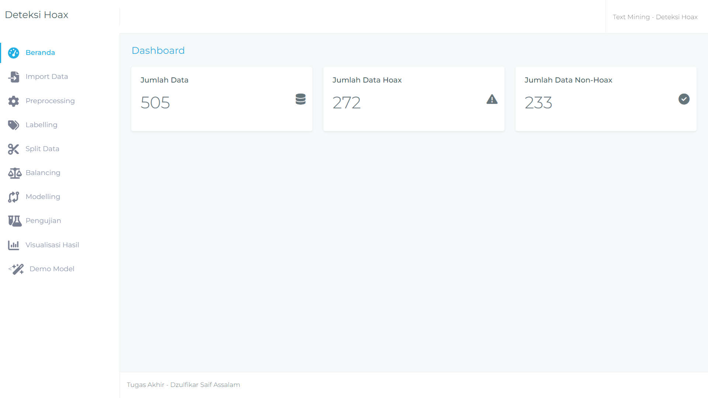
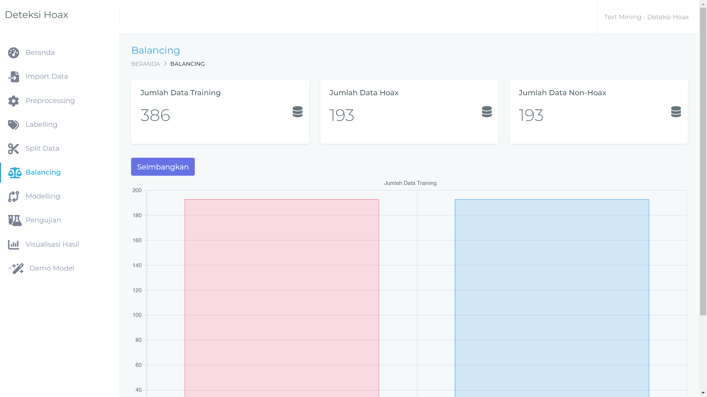
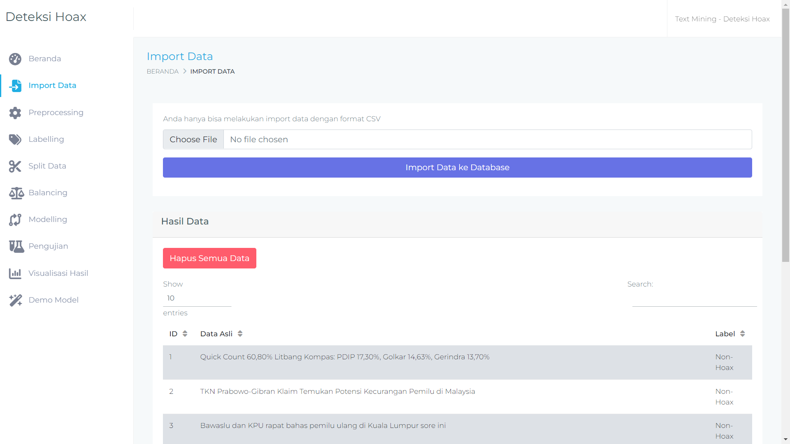
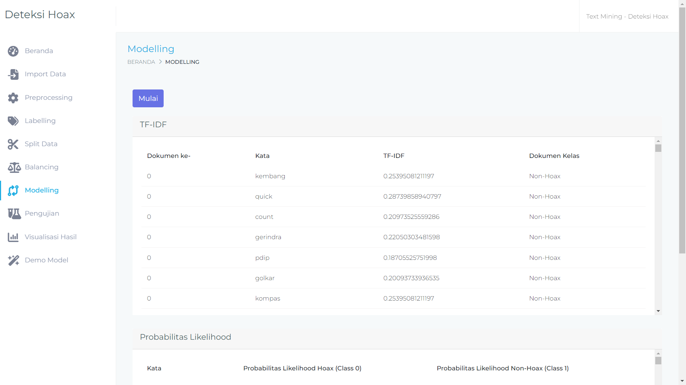
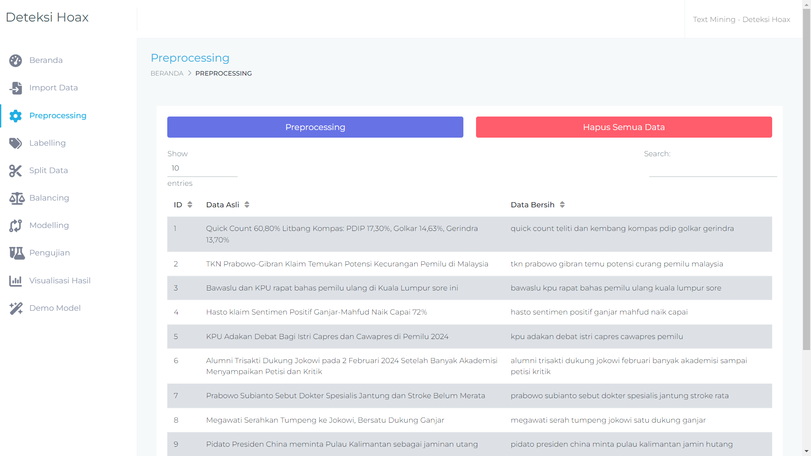
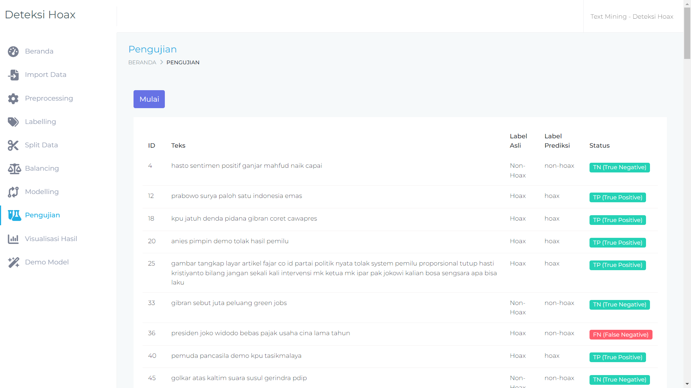
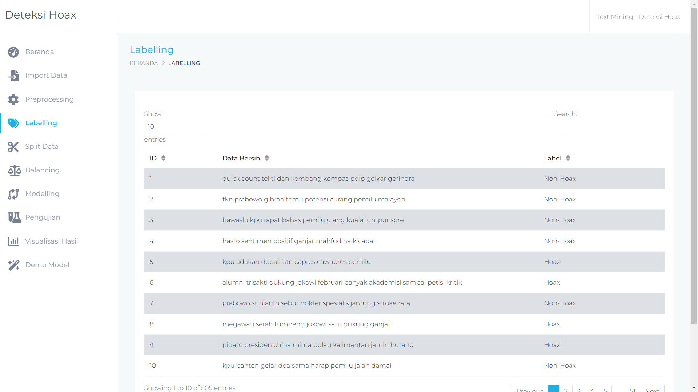
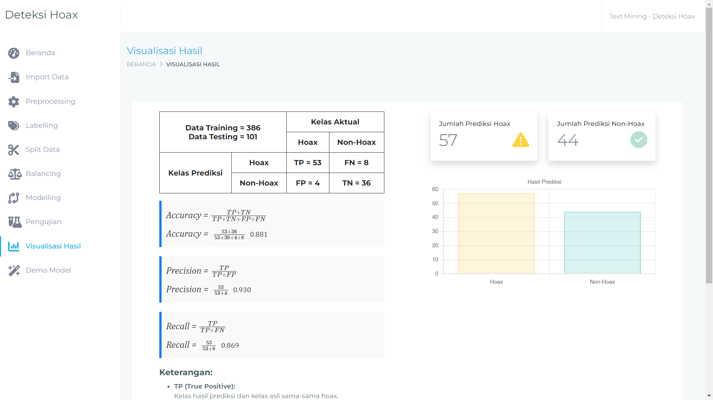
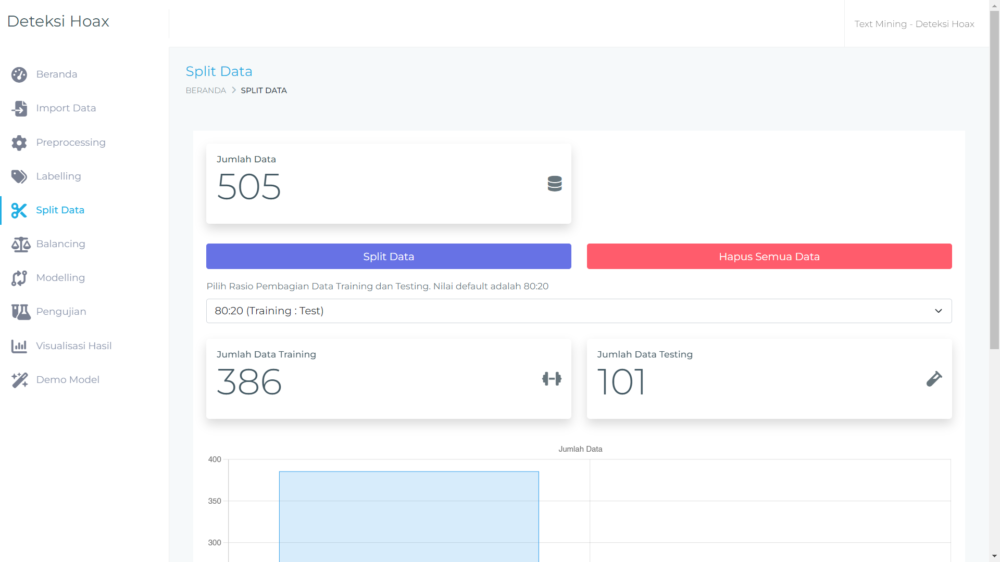
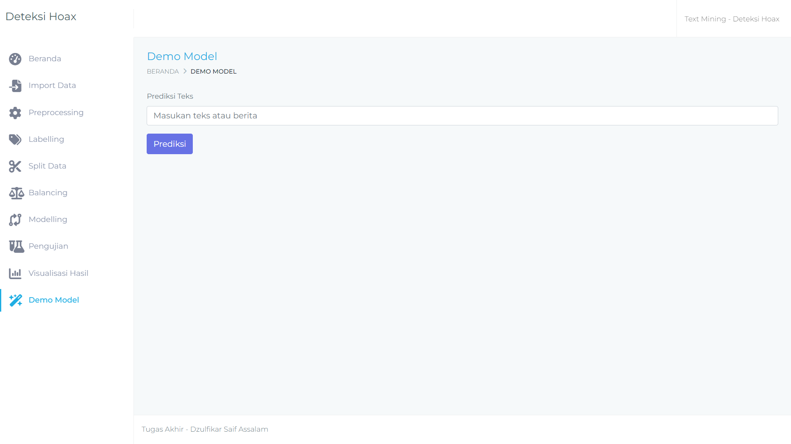

## Deteksi Hoax
Sistem Deteksi Hoax adalah aplikasi web yang dirancang untuk membantu mengidentifikasi informasi hoax.

## Fitur
- Analisis teks untuk deteksi hoax
- Tampilan antarmuka pengguna yang ramah
- Laporan hasil analisis detail

## Screenshot
<details>
  <summary>Tampilan Layar Web</summary>
  
|  |  |
|:---:|:---:|
|  |  |
|  |  |
|  |  |
|  |  |
|  |  |
  
</details>

## Cara Install

### Via Git

```bash
https://github.com/dzulfikarsa/tugas_akhir.git
```
### Download ZIP
[Link Download](https://github.com/username/repo](https://github.com/dzulfikarsa/tugas_akhir/archive/refs/heads/main.zip)](https://github.com/dzulfikarsa/tugas_akhir/archive/refs/heads/main.zip))

## Modul Crawling
### Cara Kerja
1. **Pengambilan Data**: Menggunakan permintaan POST ke API yang ditentukan untuk mengambil data berdasarkan `value` yang diberikan.
2. **Penyimpanan Data**: Jika permintaan berhasil, data akan disimpan dalam format CSV di dalam folder `data-crawling`.
3. **Manajemen File**: File CSV yang dihasilkan akan diberi nama berdasarkan timestamp dan kata kunci pencarian untuk memudahkan pengelolaan data.

### Komponen Utama
- **requests**: Untuk mengirim permintaan HTTP.
- **csv**: Untuk operasi pembacaan dan penulisan file CSV.
- **os** dan **shutil**: Untuk manajemen file dan direktori.
- pyhton version 3.9.2

### Cara Menjalankan
```bash
python crawling.py

